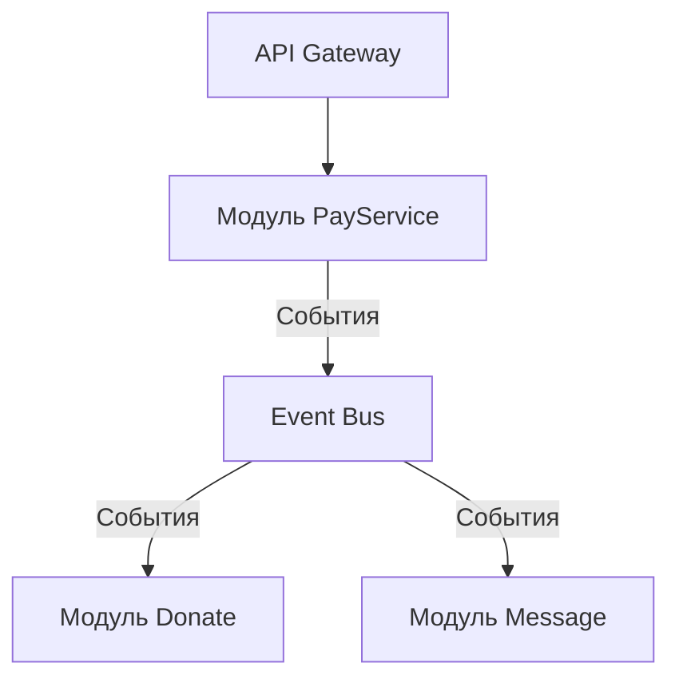

# 2. Архитектура приложения xDonate

Дата: 2025-07-14

## Статус

Принято

## Контекст

Требуется разработать серверную часть системы XDonate с ключевыми функциями:

> **User story 1.** Как пользователь я хочу, чтобы xDonate принимал платёж и сообщение к нему, после чего сообщение отображалось на стриме.

- Принять платёж от пользователя (см. User story 1)
- Обработать платёж как донат (см. User story 1)
- Извлечь сообщение из доната (см. User story 1)

## Проблемы текущего подхода

- Жёсткая связанность кода (изменения в платежах влияют на логику донатов)
- Сложности с масштабированием отдельных компонентов
- Невозможно легко заменить платёжный провайдер

## Решение: Модульный монолит с событийной шиной

### Архитектурные идеи

- Для разделения ответственности, упрощения сопровождения использовать модульный монолит
- Для уменьшения силы связи использовать событийную модель

### Набор модулей

Провести границы модулей по функциям XDonate:

- Прием платежей — модуль **PayService**
- Обработка донатов — модуль **Donate**
- Управление сообщениями — модуль **Message**

### Архитектурная схема



### Описание модулей

| Модуль     | Ответственность                    | Обрабатывает события  |
| ---------- | ---------------------------------- | --------------------- |
| PayService | Прием платежей, валидация данных   |                       |
| Donate     | Расчет суммы доната, учет комиссий | `DonatePayEvent`      |
| Message    | Сохранение/модерация сообщений     | `DonationCommitEvent` |

## Событийная коммуникация

Все модули общаются **только через события**:

### 1. Формат событий:

```ts
export class DonatePayEvent {
  public sha1_hash: string;

  constructor(
    public readonly label: string = '',
    public readonly operation_id: string = '',
    public readonly sender: string = '',
    public readonly currency: number = 0,
    public readonly amount: number = 0,
    public readonly datetime: Date = new Date(0),
    public readonly state: PaymentState = PaymentState.unknown,
    public readonly prot: PaymentProtection = PaymentProtection.unknown
  ) {}
}

export class DonateCommitEvent {
  constructor(
    public readonly donater: string,
    public readonly email: string,
    public readonly amount: number,
    public readonly comment: string,
    public readonly done: boolean,
    public readonly action_state: string
  ) {}
}
```

### 1. Подписки модулей 

- Модуль **Donate** слушает:
  - `DonatePayEvent` → начинает обработку доната
  - `DonationCommitEvent` → завершает транзакцию
- Модуль **Message** слушает:
  - `DonationCommitEvent` → сохраняет сообщение, если оно есть

### 3. Гарантии доставки:

- At-least-once доставка
- Обязательные `ack`/`nack`

## Последствия
 
- Четкие границы модулей (можно разрабатывать параллельно)
- Упрощенное тестирование (модули тестируются изолированно)
- Быстрое добавление новых платежных систем
- Сложность отладки распределенных событий
- Возможны дублирующиеся события
- Задержки в обработке

### Выбранная архитектура:

- Сохраняет преимущества монолита (простота развертывания)
- Дает гибкость микросервисов (разделение через события)
- Позволяет масштабировать компоненты по отдельности

### Следующие шаги:

- Детализировать форматы всех событий (ADR-002)
- Прототипирование Event Bus
